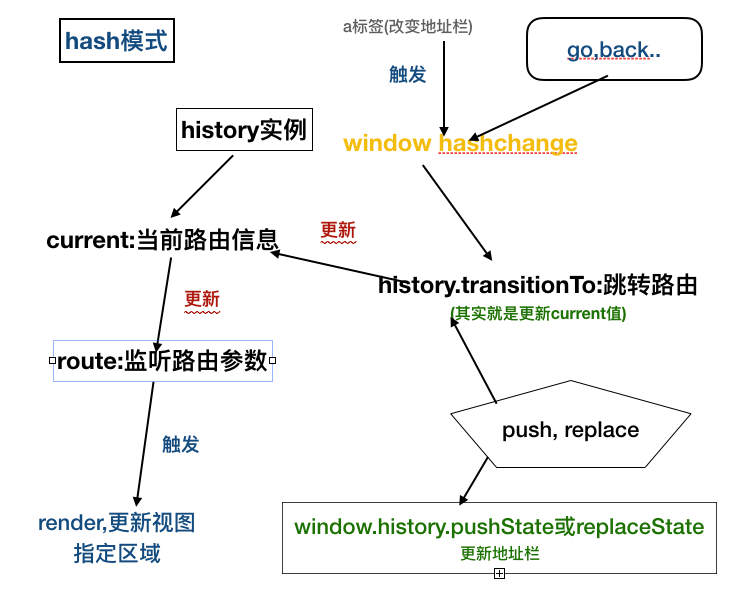
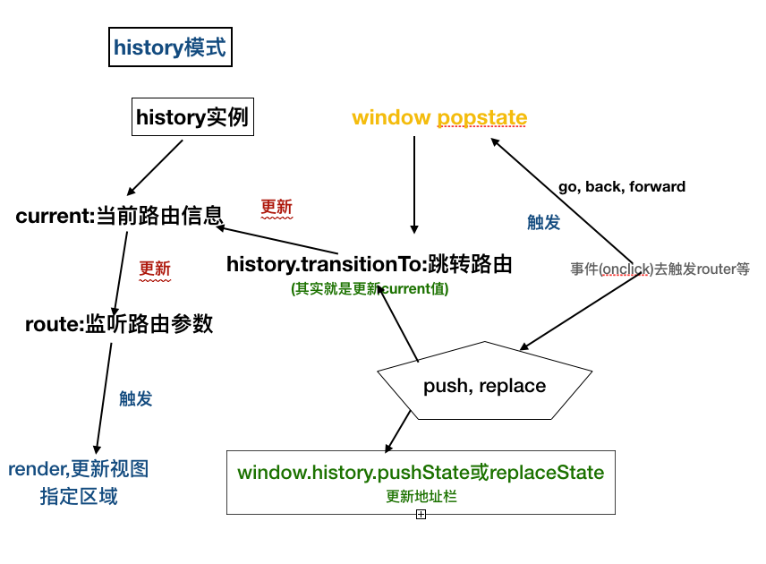

### hash模式

随着 `ajax` 的流行，异步数据请求交互运行在不刷新浏览器的情况下进行,单页应用不仅仅是在页面交互是无刷新的，连页面跳转都是无刷新的，为了实现单页应用，所以就有了前端路由。就是匹配不同的 `url` 路径，进行解析，然后动态的渲染出区域 `html` 内容
```js
http://www.baidu.com/#/login
```
这种 #。后面 `hash` 值的变化，并不会导致浏览器向服务器发出请求,每次 hash 值的变化，还会触发`hashchange` 这个事件，通过这个事件我们就可以知道 `hash` 值发生了哪些变化

<br/>

### history模式

`HTML5`标准发布。多了两个 `API`，`pushState` 和 `replaceState`，通过这两个 `API` 可以改变 `url` 地址且不会发送请求.单页路由的 `url `就不会多出一个`#`，变得更加美观

<br/>

### 参考
[参考文章](https://github.com/muwoo/blogs/issues/22)